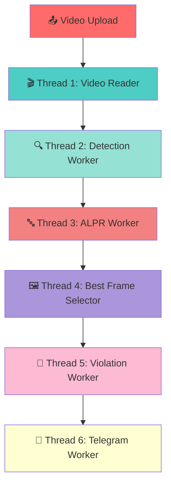

<div align="center">

# 🚗 Plate Violation Detection System

###  AI-Powered Traffic Violation Detection System 

[](https://www.python.org/)
[](https://flask.palletsprojects.com/)
[](https://github.com/ultralytics/ultralytics)
[](https://www.mysql.com/)
[](https://www.docker.com/)
[](LICENSE)


**✨ Hệ thống AI tự động nhận diện biển số xe và phát hiện vi phạm tốc độ sử dụng YOLOv11, OC-SORT Tracking và FastALPR ✨**

[🚀 Tính năng](#-tính-năng) • [🏗️ Kiến trúc](#️-kiến-trúc-hệ-thống) • [📦 Cài đặt](#-cài-đặt) • [🎮 Sử dụng](#-hướng-dẫn-sử-dụng) • [🐳 Docker](#-docker-deployment) • [☁️ AWS](#️-aws-cloud-deployment)

---

</div>

## 📋 Mục lục

<details>
<summary>Click để xem mục lục đầy đủ</summary>

- [🎯 Giới thiệu](#-giới-thiệu)
- [✨ Tính năng](#-tính-năng)
- [🏗️ Kiến trúc hệ thống](#️-kiến-trúc-hệ-thống)
- [🛠️ Công nghệ sử dụng](#️-công-nghệ-sử-dụng)
- [💻 Yêu cầu hệ thống](#-yêu-cầu-hệ-thống)
- [📦 Cài đặt](#-cài-đặt)
- [🎮 Hướng dẫn sử dụng](#-hướng-dẫn-sử-dụng)
- [🐳 Docker Deployment](#-docker-deployment)
- [☁️ AWS Cloud Deployment](#️-aws-cloud-deployment)
- [📡 API Documentation](#-api-documentation)
- [🔧 Troubleshooting](#-troubleshooting)
- [🚀 Performance Optimization](#-performance-optimization)
- [📊 System Metrics](#-system-metrics)
- [🤝 Contributing](#-contributing)
- [📝 Changelog](#-changelog)
- [👨‍💻 Tác giả](#️-tác-giả)

</details>

---

## 🎯 Giới thiệu

<div align="center">


</div>

**Plate Violation Detection System** là một hệ thống AI tiên tiến được phát triển để tự động hóa việc phát hiện và xử lý vi phạm giao thông, đặc biệt là vi phạm tốc độ. Hệ thống sử dụng các công nghệ AI/ML tiên tiến nhất hiện nay để đảm bảo độ chính xác cao và hiệu suất xử lý real-time.

### 🎓 Thông tin dự án

<table>
<tr>
<td align="center">
<strong>👨‍💻 Sinh viên</strong><br/>
Lê Hoàng Phúc
</td>
<td align="center">
<strong>🆔 MSSV</strong><br/>
190501014
</td>
<td align="center">
<strong>🏫 Trường</strong><br/>
Đại học Bình Dương<br/>Phân hiệu Cà Mau
</td>
<td align="center">
<strong>📅 Năm</strong><br/>
2024-2025
</td>
</tr>
</table>

---

</div>

## ✨ Tính năng

### 🚀 Tính năng chính

<table>
<tr>
<td width="50%">

#### 🎯 Core Features

- ✅ **Nhận diện biển số xe tự động** với độ chính xác cao (>90%)
- ✅ **Phát hiện vi phạm tốc độ** real-time
- ✅ **Tracking đa đối tượng** (OC-SORT/ByteTrack)
- ✅ **Tính toán tốc độ chính xác** dựa trên pixel movement
- ✅ **Lưu trữ bằng chứng** (ảnh xe, ảnh biển số, video vi phạm)
- ✅ **Gửi thông báo Telegram** tự động
- ✅ **Quản lý database** MySQL với full CRUD
- ✅ **Hệ thống chống trùng lặp** vi phạm (cooldown 5s)

</td>
<td width="50%">

#### 🎨 UI/UX Features

- 📊 **Dashboard** real-time với live video stream
- 📋 **Quản lý vi phạm** với bộ lọc tìm kiếm
- 👥 **Quản lý chủ xe** (Admin only)
- 🔐 **Hệ thống đăng nhập** với phân quyền (Admin/Viewer)
- 📱 **Responsive design** - tương thích mọi thiết bị
- 🎭 **Dark mode navigation** với hiệu ứng gradient
- 🔍 **Autocomplete search** cho biển số
- 📈 **Statistics dashboard** với charts

</td>
</tr>
</table>

### 🎬 Demo Video

<div align="center">


*Video demo sẽ được thêm vào sau*

</div>

---

## 🏗️ Kiến trúc hệ thống

### 6-Thread Architecture

<div align="center">



</div>

### 📊 Flow Diagram

```
┌─────────────────────────────────────────────────────────────┐
│                    📤 VIDEO UPLOAD (Flask)                  │
└────────────────────────┬────────────────────────────────────┘
                         │
                         ▼
┌─────────────────────────────────────────────────────────────┐
│  🎬 THREAD 1: Video Thread                                    │
│  • Đọc frame từ video                                        │
│  • Push vào detection_queue                                  │
│  • Buffer frames cho active tracks                            │
└────────────────────────┬────────────────────────────────────┘
                         │ detection_queue
                         ▼
┌─────────────────────────────────────────────────────────────┐
│  🔍 THREAD 2: Detection Worker                               │
│  • YOLOv11n: Detect vehicles                                 │
│  • OC-SORT: Track objects                                    │
│  • SpeedTracker: Calculate speed                             │
│  • Detect violations (> speed_limit)                        │
└────────────────────────┬────────────────────────────────────┘
                         │ alpr_realtime_queue
                         ▼
┌─────────────────────────────────────────────────────────────┐
│  🔤 THREAD 3: ALPR Worker (Real-time)                        │
│  • FastALPR: Detect license plates                          │
│  • Validate plate format (Vietnamese)                       │
│  • Aggregate multiple detections                             │
└────────────────────────┬────────────────────────────────────┘
                         │ best_frame_queue
                         ▼
┌─────────────────────────────────────────────────────────────┐
│  🖼️ THREAD 4: Best Frame Selector                            │
│  • Select best quality frame                                 │
│  • Aggregate plate detections                                │
│  • Add violation timestamp & frame number                    │
└────────────────────────┬────────────────────────────────────┘
                         │ violation_queue
                         ▼
┌─────────────────────────────────────────────────────────────┐
│  💾 THREAD 5: Violation Worker                                │
│  • Save to MySQL database                                    │
│  • Create violation videos (FFmpeg/OpenCV)                   │
│  • Save vehicle & plate images                               │
│  • Anti-duplicate check (5s cooldown)                        │
└────────────────────────┬────────────────────────────────────┘
                         │ telegram_queue
                         ▼
┌─────────────────────────────────────────────────────────────┐
│  📱 THREAD 6: Telegram Worker                                │
│  • Send notifications to Telegram                           │
│  • Update violation status                                   │
│  • Handle retry logic                                        │
└─────────────────────────────────────────────────────────────┘
```

---

## 🛠️ Công nghệ sử dụng

### Backend Stack

<div align="center">

| Category | Technology | Version |
|:--------:|:----------:|:-------:|
| 🐍 **Language** | Python | 3.10+ |
| 🌐 **Framework** | Flask | 3.0.0 |
| 🗄️ **Database** | MySQL | 8.0 |
| 🧠 **ML Framework** | PyTorch | 2.0+ |
| 📦 **Package Manager** | pip | Latest |

</div>

### AI/ML Models

<div align="center">

| Model | Purpose | Accuracy |
|:-----:|:-------:|:--------:|
| 🎯 **YOLOv11n** | Vehicle Detection | >95% |
| 🔄 **OC-SORT** | Multi-object Tracking | >90% |
| 🔤 **FastALPR** | License Plate Recognition | >85% |
| ⚡ **ByteTrack** | Fallback Tracker | >88% |

</div>

### Frontend Stack

<div align="center">

| Technology | Purpose |
|:---------:|:-------:|
| 🎨 **Bootstrap 4.6.2** | UI Framework |
| 🎭 **Font Awesome 6.5.1** | Icons |
| 📝 **Inter Font** | Typography |
| ⚡ **jQuery** | DOM Manipulation |
| 📊 **Chart.js** | Data Visualization |

</div>

---

## 💻 Yêu cầu hệ thống

### Minimum Requirements

<div align="center">

| Component | Specification |
|:---------:|:------------:|
| 💻 **OS** | Windows 10/11, Ubuntu 20.04+, macOS 11+ |
| 🖥️ **CPU** | Intel Core i5 hoặc tương đương |
| 💾 **RAM** | 8GB (khuyến nghị 16GB) |
| 💿 **Storage** | 10GB free space |
| 🐍 **Python** | 3.10+ |

</div>

### Recommended (for GPU acceleration)

<div align="center">

| Component | Specification |
|:---------:|:------------:|
| 🎮 **GPU** | NVIDIA GPU với CUDA 11.8+ |
| 🧠 **VRAM** | 4GB+ |
| ⚡ **CUDA** | 11.8 |
| 🔧 **cuDNN** | 8.x |

</div>

---

## 📦 Cài đặt

### 🚀 Quick Start

```bash
# 1. Clone repository
git clone https://github.com/LeHoangPhuc2310/plate_violation_system.git
cd plate_violation_system

# 2. Create virtual environment
python -m venv venv

# Windows
venv\Scripts\activate

# Linux/macOS
source venv/bin/activate

# 3. Install dependencies
pip install -r requirements.txt

# 4. Configure MySQL (see below)
# 5. Run application
python app.py
```

### 📋 Step-by-Step Installation

<details>
<summary><b>🔽 Click để xem hướng dẫn chi tiết</b></summary>

#### 1️⃣ Clone Repository

```bash
git clone https://github.com/LeHoangPhuc2310/plate_violation_system.git
cd plate_violation_system
```

#### 2️⃣ Create Virtual Environment

```bash
# Windows
python -m venv venv
venv\Scripts\activate

# Linux/macOS
python3 -m venv venv
source venv/bin/activate
```

#### 3️⃣ Install Dependencies

```bash
# CPU version
pip install -r requirements.txt

# GPU version (NVIDIA CUDA 11.8)
pip install torch torchvision --index-url https://download.pytorch.org/whl/cu118
pip install -r requirements.txt
```

#### 4️⃣ Configure MySQL Database

```sql
CREATE DATABASE plate_violation CHARACTER SET utf8mb4 COLLATE utf8mb4_unicode_ci;
USE plate_violation;
SOURCE init.sql;
```

#### 5️⃣ Configure Telegram Bot (Optional)

1. Tạo bot mới với [@BotFather](https://t.me/botfather)
2. Lấy Bot Token
3. Lấy Chat ID của bạn
4. Cập nhật trong `app.py`:

```python
TELEGRAM_BOT_TOKEN = "your_bot_token_here"
TELEGRAM_CHAT_ID = "your_chat_id_here"
```

#### 6️⃣ Run Application

```bash
python app.py
```

Truy cập: **http://localhost:5000**

**Tài khoản mặc định:**
- Username: `admin` / Password: `admin123` (Admin)
- Username: `viewer` / Password: `viewer123` (Viewer)

</details>

---

## 🎮 Hướng dẫn sử dụng

### 📱 User Guide

<details>
<summary><b>🔽 Click để xem hướng dẫn sử dụng</b></summary>

#### 1️⃣ Đăng nhập

- Truy cập http://localhost:5000
- Đăng nhập với tài khoản admin hoặc viewer

#### 2️⃣ Upload Video

- Click **"Upload Video"** trên Dashboard
- Chọn file video (MP4, AVI, MOV)
- Click **"Upload"** để bắt đầu xử lý

#### 3️⃣ Xem Live Stream

- Video sẽ hiển thị real-time với bounding boxes
- Thông tin tracking và tốc độ hiển thị trên mỗi xe
- Violations được highlight màu đỏ

#### 4️⃣ Xem Vi Phạm

- Click **"Xem vi phạm"** trên navbar
- Sử dụng bộ lọc để tìm kiếm:
  - Biển số xe
  - Khoảng thời gian
  - Mức vượt tốc độ
- Click vào violation để xem chi tiết

#### 5️⃣ Quản lý Chủ Xe (Admin only)

- Click **"Quản trị"** trên navbar
- Thêm/Sửa/Xóa thông tin chủ xe
- Tìm kiếm theo biển số, tên, địa chỉ, SĐT

</details>

---

## 🐳 Docker Deployment

### 🚀 Quick Start with Docker Compose

```bash
# Build and run
docker-compose up -d

# View logs
docker-compose logs -f app

# Stop services
docker-compose down
```

### 📦 Manual Docker Build

<details>
<summary><b>🔽 Click để xem hướng dẫn Docker</b></summary>

#### CPU Version

```bash
docker build -f Dockerfile.cpu -t plate-violation:cpu .
docker run -d -p 5000:5000 \
  -v $(pwd)/static:/app/static \
  --name plate-violation \
  plate-violation:cpu
```

#### GPU Version (requires NVIDIA Docker)

```bash
docker build -f Dockerfile -t plate-violation:gpu .
docker run -d -p 5000:5000 \
  --gpus all \
  -v $(pwd)/static:/app/static \
  --name plate-violation \
  plate-violation:gpu
```

</details>

---

## ☁️ AWS Cloud Deployment

### 🚀 Deploy to AWS EC2

<details>
<summary><b>🔽 Click để xem hướng dẫn AWS</b></summary>

#### Prerequisites

- AWS Account
- AWS CLI configured
- Docker installed

#### Steps

1. **Launch EC2 Instance**
   - AMI: Ubuntu 22.04 LTS
   - Instance Type: t3.medium (minimum)
   - Security Group: Allow ports 22, 80, 443, 5000

2. **Connect to EC2**

```bash
ssh -i your-key.pem ubuntu@your-ec2-ip
```

3. **Install Docker**

```bash
sudo apt update
sudo apt install -y docker.io docker-compose
sudo usermod -aG docker $USER
```

4. **Clone and Deploy**

```bash
git clone https://github.com/LeHoangPhuc2310/plate_violation_system.git
cd plate_violation_system
docker-compose up -d
```

5. **Access Application**

- http://your-ec2-ip:5000

</details>

---

## 📡 API Documentation

### 🔐 Authentication Endpoints

| Method | Endpoint | Description |
|:------:|:--------:|:-----------|
| `POST` | `/login` | Login to system |
| `GET` | `/logout` | Logout from system |

### 🎬 Video Processing Endpoints

| Method | Endpoint | Description |
|:------:|:--------:|:-----------|
| `POST` | `/upload` | Upload video for processing |
| `GET` | `/video_feed` | Get MJPEG video stream |
| `POST` | `/stop_camera` | Stop video processing |

### 📋 Violation Management Endpoints

| Method | Endpoint | Description |
|:------:|:--------:|:-----------|
| `GET` | `/history` | Get violation list with filters |
| `GET` | `/autocomplete` | Autocomplete license plate search |

### 👨‍💼 Admin Endpoints (Admin only)

| Method | Endpoint | Description |
|:------:|:--------:|:-----------|
| `GET` | `/admin/vehicles` | Get vehicle owner list |
| `POST` | `/edit_owner/<plate>` | Update vehicle owner information |
| `GET` | `/delete/<plate>` | Delete vehicle owner |

---

## 🔧 Troubleshooting

### ❌ Common Issues

<details>
<summary><b>🔽 Click để xem troubleshooting</b></summary>

#### Video không hiển thị

- Kiểm tra browser console (F12) để xem lỗi
- Đảm bảo `/video_feed` endpoint đang hoạt động
- Thử refresh trang (Ctrl+F5)

#### Detection chậm

- Sử dụng GPU nếu có thể
- Giảm resolution video input
- Tăng `DETECTION_SKIP_FRAMES` trong app.py

#### Database connection error

- Kiểm tra MySQL service đang chạy
- Verify database credentials trong app.py
- Đảm bảo database `plate_violation` đã được tạo

#### Telegram không gửi được

- Kiểm tra Bot Token và Chat ID
- Verify bot đã được start (@BotFather)
- Kiểm tra internet connection

</details>

---

## 🚀 Performance Optimization

### ⚡ Optimization Tips

<details>
<summary><b>🔽 Click để xem optimization tips</b></summary>

#### CPU Optimization

- Sử dụng YOLOv11n (nano) thay vì YOLOv11s/m/l
- Tăng `DETECTION_SKIP_FRAMES` để giảm số frame xử lý
- Giảm resolution video input

#### GPU Optimization

- Cài đặt CUDA 11.8 và cuDNN 8.x
- Sử dụng PyTorch với CUDA support
- Tăng batch size nếu VRAM đủ lớn

#### Database Optimization

- Tạo index cho các cột thường query (plate, time)
- Sử dụng connection pooling
- Định kỳ optimize tables

</details>

---

## 📊 System Metrics

### 📈 Performance Metrics

<div align="center">

| Metric | Value |
|:------:|:-----:|
| **YOLOv11n FPS** | ~50-100 FPS (GPU), ~5-15 FPS (CPU) |
| **OC-SORT Tracking** | ~200 FPS |
| **FastALPR** | ~30-50 FPS |
| **Overall System** | ~10-30 FPS (depends on hardware) |

</div>

### 🎯 Accuracy Metrics

<div align="center">

| Metric | Accuracy |
|:------:|:--------:|
| **Vehicle Detection** | >95% |
| **License Plate Detection** | >90% |
| **Plate Recognition** | >85% (Vietnamese plates) |
| **Speed Calculation** | ±5 km/h |

</div>

---

## 🤝 Contributing

Contributions are welcome! Please follow these steps:

1. 🍴 Fork the repository
2. 🌿 Create a feature branch (`git checkout -b feature/AmazingFeature`)
3. 💾 Commit your changes (`git commit -m 'Add some AmazingFeature'`)
4. 📤 Push to the branch (`git push origin feature/AmazingFeature`)
5. 🔄 Open a Pull Request

---

## 📝 Changelog

### 🎉 Version 2.0.0 (2024-12-16)

- ✅ Implemented 6-thread architecture for better performance
- ✅ Added anti-duplicate violation system (5s cooldown)
- ✅ Improved UI/UX with professional design
- ✅ Added Docker and Docker Compose support
- ✅ Enhanced database schema with proper indexes
- ✅ Fixed video stream display issues
- ✅ Optimized ALPR processing pipeline
- ✅ Fixed video creation bug (FFmpeg/OpenCV fallback)
- ✅ Added organized folder structure (YYYY/MM/DD/PLATE)

### 🎉 Version 1.0.0 (2024-11-01)

- 🎉 Initial release
- ✅ Basic vehicle detection and tracking
- ✅ License plate recognition
- ✅ Speed violation detection
- ✅ MySQL database integration
- ✅ Telegram notifications

---

## 📄 License

This project is licensed under the **MIT License** - see the [LICENSE](LICENSE) file for details.

---

## 👨‍💻 Tác giả

<div align="center">

<table>
<tr>
<td align="center">
<a href="https://github.com/LeHoangPhuc2310">

<br />
<sub><b>Lê Hoàng Phúc</b></sub>
</a>
</td>
</tr>
</table>

**Lê Hoàng Phúc**
- 🆔 MSSV: 190501014
- 🏫 Trường: Đại học Bình Dương - Phân hiệu Cà Mau
- 📧 Email: lehoangphuc2310@gmail.com
- 💻 GitHub: [@LeHoangPhuc2310](https://github.com/LeHoangPhuc2310)

</div>

---

## 🙏 Acknowledgments

<div align="center">

| Project | Purpose |
|:-------:|:-------:|
| [Ultralytics YOLOv11](https://github.com/ultralytics/ultralytics) | Object detection |
| [OC-SORT](https://github.com/noahcao/OC_SORT) | Multi-object tracking |
| [FastALPR](https://github.com/ankandrew/fast-alpr) | License plate recognition |
| [Flask](https://flask.palletsprojects.com/) | Web framework |
| [Bootstrap](https://getbootstrap.com/) | UI framework |

</div>

---

## 📞 Support

Nếu bạn gặp vấn đề hoặc có câu hỏi, vui lòng:

- 🐛 Mở [Issue](https://github.com/LeHoangPhuc2310/plate_violation_system/issues) trên GitHub
- 📧 Email: lehoangphuc2310@gmail.com

---

<div align="center">

### ⭐ Nếu project này hữu ích, hãy cho một star nhé! ⭐


**Made with ❤️ by Lê Hoàng Phúc**


</div>
